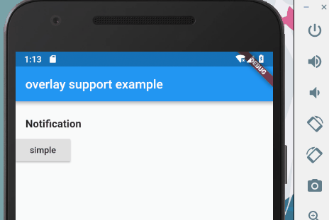

# overlay_support

provider support for overlay, easy to build toast and internal notification

## A picture is worth a thousand words



## How To Use

1. add dependencies into you project pubspec.yaml file
```
    overlay_support:
    git:
      url: git://github.com/boyan01/overlay_support.git
```
2. import package into your dart file

```dart
import 'package:overlay_support/overlay_support.dart';
```

3. use `showSimpleNotification` method to show a notification at top of screen

```dart
showSimpleNotification(context,
    Text("this is a message from simple notification"),
    background: Colors.green);
```

## TODO

- [ ] add toast support

## License 

see License File
