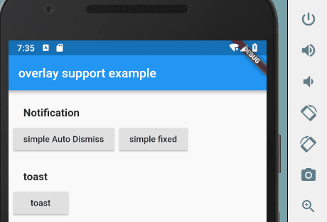
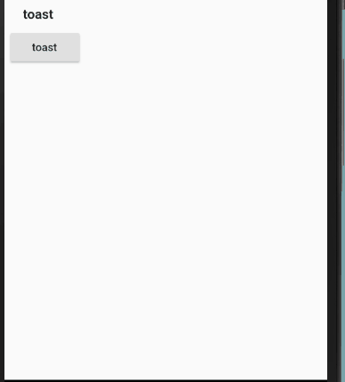

# overlay_support 
[](https://pub.dartlang.org/packages/overlay_support)
[](https://travis-ci.com/boyan01/overlay_support)
[](https://codecov.io/gh/boyan01/overlay_support)

provider support for overlay, easy to build toast and internal notification.

## A picture is worth a thousand words





## How To Use

1. add dependencies into you project pubspec.yaml file
```
dependencies:
  overlay_support: ^0.0.4
```
2. import package into your dart file

```dart
import 'package:overlay_support/overlay_support.dart';
```

3. use `showSimpleNotification` method to show a notification at top of screen

```dart
showSimpleNotification(context,
    Text("this is a message from simple notification"),
    background: Colors.green);
```

## License 

see License File
